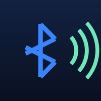

# Home Assistant Apps

> **Part of the [Home Audio Stack](https://github.com/shuricksumy/home-audio-stack)** — Music Assistant → Snapcast → PipeWire, into USB DACs, Bluetooth speakers and LED strips. That page maps how these projects fit together.

[](https://github.com/shuricksumy/home-assistant-apps/actions/workflows/lint.yaml)
[](LICENSE)

Home Assistant's Ingress only serves **add-ons**. So anything worth giving its
own hardware — a music server on a box wired to your DAC, a camera analyser on a
machine with a GPU — loses its place in the sidebar the moment you move it off
the Home Assistant host.

These add-ons put it back. Each one is a small proxy: the service keeps running
where it belongs, and Home Assistant shows it with its own login in front,
working from outside over Nabu Casa like anything else. Nothing is exposed to the
internet.

**Setting up the audio side too?** The [Home Audio Stack](https://github.com/shuricksumy/home-audio-stack) has a [complete compose file](https://github.com/shuricksumy/home-audio-stack/tree/main/examples) for the services these add-ons surface.

## Adding this repository

[](https://my.home-assistant.io/redirect/supervisor_add_addon_repository/?repository_url=https%3A%2F%2Fgithub.com%2Fshuricksumy%2Fhome-assistant-apps)

Or by hand: **Settings → Add-ons → Add-on Store → ⋮ → Repositories**, then add

```
https://github.com/shuricksumy/home-assistant-apps
```

Requires Home Assistant OS or Supervised. Home Assistant Container has no add-on
store.

## Add-ons

| | Add-on | What it gives you |
| :---: | ------ | ----------------- |
|  | **[Music Assistant Proxy](music_assistant_proxy)** | Music Assistant running on its own hardware, in your Home Assistant sidebar |
|  | **[Frigate Yard Stats Proxy](frigate_yard_stats_proxy)** | Frigate yard activity and vehicle reports, in your Home Assistant sidebar |
|  | **[Bluetooth Web Snapclient Proxy](bluetooth_web_proxy)** | Pair Bluetooth speakers and run Snapcast players on another machine, in your Home Assistant sidebar |

They all solve the same problem: a service worth giving its own hardware loses its
place in the sidebar, because Ingress only serves add-ons. These put it back —
without exposing the service itself to anything but your network.

### Music Assistant Proxy

Music Assistant's own add-on runs the server on your Home Assistant machine. If you
would rather run it on dedicated hardware — a NAS, a mini PC, anything with the
headroom for library scans and transcoding — you lose the sidebar panel, because
Ingress only serves add-ons.

This add-on is an nginx reverse proxy that gives it back. It does **not** run Music
Assistant; it puts a server running elsewhere behind Home Assistant's Ingress, so the
panel appears in the sidebar and is reachable wherever Home Assistant is, without
exposing Music Assistant itself.

It also works around a quirk of the current Music Assistant release, which decides it
is running as an add-on purely from the URL and then refuses to show a login form.
[The add-on docs](music_assistant_proxy/DOCS.md) explain what is rewritten and why,
how signing in works, and what to expect when Music Assistant updates.

### Frigate Yard Stats Proxy

Same idea for [Frigate Yard Stats](https://github.com/shuricksumy/frigate-yard-stats):
the report UI runs alongside Frigate on its own hardware, and this puts it in the
sidebar. Unlike the Music Assistant proxy it does no response rewriting — that service
resolves its own URLs relative to the page, so nothing here is pinned to an upstream
version. See [its docs](frigate_yard_stats_proxy/DOCS.md).

## License

MIT — see [LICENSE](LICENSE).
